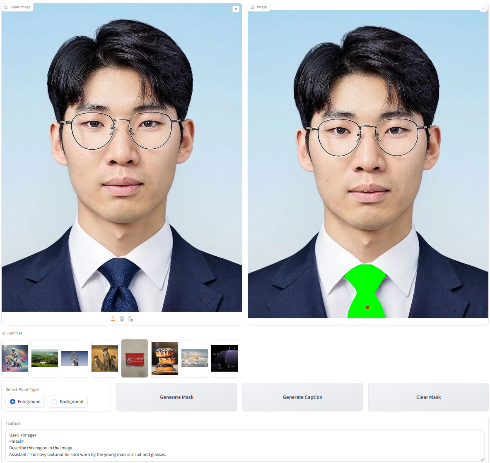

<div align="center">
<h1>URECA💡: Unique Region Caption Anything</h1>

[**Sangbeom Lim**](https://sangbeomlim.github.io/)<sup>1\*</sup> · [**Junwan Kim**](https://junwankimm.github.io/)<sup>2\*</sup> · [**Heeji Yoon**](https://github.com/yoon-heez)<sup>3</sup> · [**Jaewoo Jung**](https://crepejung00.github.io/)<sup>3</sup> · [**Seungryong Kim**](https://cvlab.kaist.ac.kr/members/faculty)<sup>3&dagger;</sup>

<sup>1</sup>Korea University&emsp;&emsp;&emsp;&emsp;<sup>2</sup>Yonsei University&emsp;&emsp;&emsp;&emsp;<sup>3</sup>KAIST AI

*: Equal Contribution <br>
&dagger;: Corresponding Author

**ArXiv 2025**

<a href="https://arxiv.org/abs/2504.05305"></a>
<a href="https://cvlab-kaist.github.io/URECA"></a>
<a href="https://huggingface.co/spaces/junwann/URECA">


<p float='center'></p>
<span style="color: green; font-size: 1.3em; font-weight: bold;">URECA can generate <span style="color:darkolivegreen;font-weight:bold;">Unique Caption</span> for <span style="font-weight:bold;">Any Granularity Regions!</span></span>
</div>


## 📰 News
* **2025-04-06:** [URECA](https://github.com/cvlab-kaist/URECA) is released.
* **2025-04-06:** Training Code, Data collection pipeline, and URECA Model are released.
* **2025-04-08:** Our [ArXiv Paper](https://arxiv.org/abs/2504.05305) is released!
* 🌟 Featured: URECA is now highlighted as a **Paper of the Day** on [Daily Papers](https://huggingface.co/papers/2504.05305) page on HuggingFace! 🌟
* **2025-07-08:** URECA training dataset is released!

**Please stay tuned for a URECA Dataset and Evaluation Code!**

## 🔥 TODO
- [x] Train Code (Apr 6, 2025)
- [x] Pre-trained weights (Apr 6, 2025)
- [x] Code of interactive demo (Apr 6, 2025)
- [x] Demo update (Apr 6, 2025)
- [x] Release ArXiv paper (Apr 8, 2025)
- [x] Training Dataset release (Jul 8, 2025)
- [ ] Evaluation Code 
- [ ] Test Dataset release

## Environment
```bash
conda create -n ureca python=3.9
conda activate ureca

conda install pytorch==2.5.1 torchvision==0.20.1 torchaudio==2.5.1 pytorch-cuda=12.4 -c pytorch -c nvidia
pip install -r requirements.txt
```

## 🎮Demo
<p float='center'></p>

Please Download [SAM](https://github.com/facebookresearch/segment-anything) and place it on models folder.  
Download URECA Model by following below script.
```bash
mkdir models
cd models
git lfs install
git clone https://huggingface.co/SammyLim/URECA
mkdir sam
! Download SAM-H model weight manually!
python gradio_demo/app.py
```

## Data Curation Pipeline
- **[Data Curation Pipeline](./data_curation_pipeline/README.md)**

## Training
- **[URECA Training](./ureca_model/README.md)**


[//]: # (## Evaluation)

[//]: # (- **[URECA Evaluation]&#40;./evaluation/EVAL.md&#41;**)

[//]: # (## Datasets)

## Dataset
### Training dataset
We release our URECA training dataset that has **138,152** mask-caption pair! In order to download image-mask pair, please download [SA-1B](https://ai.meta.com/datasets/segment-anything/).
Get URECA training caption file from [Huggingface Link](https://huggingface.co/datasets/SammyLim/URECA/tree/main)!


## 📚 Citing this Work
Please use the following bibtex to cite our work:
```
@article{lim2025ureca,
  title={URECA: Unique Region Caption Anything},
  author={Lim, Sangbeom and Kim, Junwan and Yoon, Heeji and Jung, Jaewoo and Kim, Seungryong},
  journal={arXiv preprint arXiv:2504.05305},
  year={2025}
}
```

## 🙏 Acknowledgement
This project is largely based on the [InternVL repository](https://github.com/OpenGVLab/InternVL). Thanks to the authors for their invaluable work and contributions.
